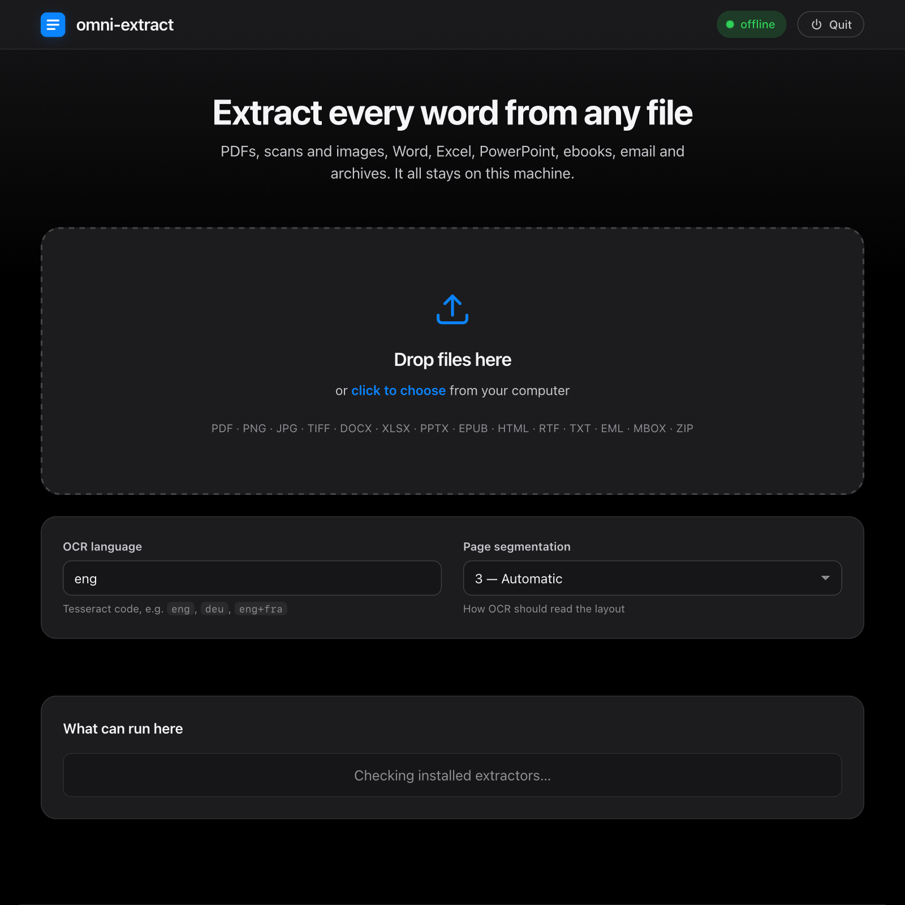

# omni-extract

> Feed it **any file** — a scanned PDF, a phone photo of a receipt, a Word
> document, an email, a zip full of mixed junk — and get back **all the text it
> can possibly recover**. Fully **offline**. Fast. It never crashes on a bad
> file, and it never invents a single character it didn't actually read.

**By Daniel Bratcher · [@danieldevelopes-collab](https://github.com/danieldevelopes-collab)**
· MIT licensed · Python 3 · **the core has zero third-party dependencies**

```bash
omni-extract scan.pdf                 # → text on stdout
omni-extract -f csv ./invoices/       # → one row per document (csv / jsonl / json / md)
omni-extract --serve                  # → open the desktop-grade UI in your browser
omni-extract --out text/ ./inbox/     # → mirror a whole folder to files
omni-extract --capabilities           # → what's installed + how to get the rest
```

---

## The deceptively hard problem

"Just get the text out of the file." It sounds like a one-liner. It is not.

A `.docx` is not a document — it's a **zip archive of XML**. A modern PDF might
contain perfectly selectable text, or it might be **nothing but a photograph of
a page** with no text in it at all, and the only way to know is to look. A
`.txt` file doesn't tell you whether it's UTF-8, UTF-16, or Windows-1252, and
guessing wrong turns *"café"* into *"café"*. A file called `report.txt` might
actually be a PDF that somebody renamed. An email is a nest of MIME parts. A
screenshot is just pixels — there is no text in there until an OCR engine
*reads* it the way a human eye would.

So a tool that genuinely handles **"any file"** has to be several tools wearing
a trench coat: a file-type detective that doesn't trust file extensions, a
router, a dozen specialised extractors, an OCR engine for the pixels, a
recursion engine for the archives, and a normaliser to make all of it come out
clean and comparable. That is what omni-extract is.

And the moment you involve OCR, you are standing on the shoulders of a century
of people who tried to teach machines to read. They deserve a section.

---

## A short history of reading machines

Optical Character Recognition is older than the computer.

- **1913 — The Optophone.** The Irish physicist **Edmund Fournier d'Albe**
  built a handheld device that scanned printed letters and turned them into
  musical tones, so that blind readers could *hear* a page. It read about one
  word per minute. It was the first machine that "read."
- **1914 — Emanuel Goldberg.** The physicist **Emanuel Goldberg** built a
  machine that read characters and converted them into telegraph code. In the
  1920s–30s he went further and built a "Statistical Machine" that searched
  microfilm archives using optical character recognition — a patent later
  acquired by IBM. He is one of the true grandfathers of the field.
- **1931 — The Reading Machine patent.** **Gustav Tauschek** in Germany (and,
  in parallel, **Paul W. Handel** in the US) patented optical-mechanical
  machines that matched characters against templates with a photodetector.
- **1949 — GISMO.** The American cryptanalyst **David H. Shepard**, with
  **Harvey Cook Jr.**, built a machine nicknamed *GISMO* that read printed text
  and converted it to machine language. Shepard founded **Intelligent Machines
  Research Corporation**, which delivered the **first commercial OCR systems**
  in the mid-1950s (one of the earliest read magazine subscription coupons for
  *Reader's Digest*). He is widely called the father of commercial OCR.
- **1950s — Jacob Rabinow** built reading and mail-sorting machines that pushed
  OCR into industry.
- **1968 — The OCR typefaces.** **Adrian Frutiger** designed **OCR-B**, the
  humanist typeface engineered to be read by both machines and people, a
  companion to the starkly mechanical OCR-A.
- **1974–1976 — Ray Kurzweil.** **Ray Kurzweil** invented the first
  **omni-font OCR** — software that could read virtually *any* printed
  typeface, not just one machine font. He paired it with a flatbed scanner and a
  text-to-speech synthesiser to build the **Kurzweil Reading Machine (1976)**, a
  device that read printed books aloud to blind people. **Stevie Wonder** owned
  one of the first units and remained a lifelong champion of the technology.
- **1984–1994 — Tesseract is born.** At **Hewlett-Packard's** labs, **Ray
  Smith** and colleagues developed an OCR engine called **Tesseract**. In the
  1995 University of Nevada accuracy trials it was among the most accurate
  engines in the world — and then it sat, unreleased, for a decade.
- **2005 — Tesseract goes open source.** HP and UNLV released Tesseract to the
  world.
- **2006 → today — Google & the neural turn.** **Google** sponsored Tesseract's
  continued development, still led for years by **Ray Smith**. Version 4 (2018)
  replaced the classic algorithm with an **LSTM neural network**, and modern
  Tesseract reads **100+ languages**. Its image-processing foundation,
  **Leptonica**, was written by **Dan Bloomberg**.

omni-extract's OCR is Tesseract. When you point this tool at a photograph and
text comes out, that text is the inheritance of every name above.

---

## The story behind this project

omni-extract is personal. It was my **first project that put two things
together at once — packaging real software in Docker, and running a
machine-learning model end to end.**

The "model" is easy to miss. Modern Tesseract (v4 and later) does *not*
pattern-match characters the way the 1990s engines did — it runs an **LSTM
recurrent neural network**, trained on millions of rendered text-lines and
shipped as a single file, `eng.traineddata`. So when you run:

```bash
docker run --rm -v "$PWD:/data" omni-extract scan.pdf
```

you are starting a container, loading a trained neural network into memory, and
watching it *read* a page — with the recovered text landing on stdout a moment
later. That whole loop — **a file in, a container up, a model running, text
out** — is the thing that made automation finally click for me. Everything else
in this repository grew outward from that one satisfying moment.

---

## How omni-extract works

```
file → DETECT → ROUTE → EXTRACT (with fallback chain) → NORMALIZE → Document(text + metadata)
```

1. **Detect** — magic-byte signatures first, then *container sniffing* for the
   ambiguous cases (a `PK\x03\x04` file might be a `.docx`, `.xlsx`, `.pptx`,
   `.epub`, or a plain zip; a `RIFF` file might be `.webp`, `.wav`, or `.avi`),
   then the extension as a hint, then a UTF-8 heuristic. Only the first 64 KB
   are read, so detection is O(1) even on a multi-gigabyte file.
2. **Route** — a registry maps the detected kind to an ordered list of backends,
   each of which knows whether it's actually available right now.
3. **Extract, with a fallback chain** — the best backend is tried first; if it
   yields too little text, the next is tried. The signature trick lives in the
   PDF backend: it reads each page's **embedded text first** and only sends the
   pages that come back empty — the scanned ones — to OCR. A 500-page digital
   PDF never wakes the OCR engine; a scanned one is fully recovered.
4. **Normalize** — Unicode NFC, control-character stripping, de-hyphenation of
   words split across line ends, whitespace tidy → one uniform `Document`.

Every result records **which backend ran, the method used for each page, and
any warnings**, so nothing is ever silently faked.

---

## Proof: ten formats in, the same text out

The acid test for an extractor is a **round-trip**: take one sentence, bake it
into many different file formats, extract each, and check you get the *exact*
sentence back. omni-extract ships this as a test (`tests/test_roundtrip.py`):

```
canonical: "The quick brown fox jumps over the lazy dog and the sphinx of black quartz judges my vow."

  format     exact?  extracted
  ----------------------------------------------------------------------------
  txt        MATCH   The quick brown fox jumps over the lazy dog and the sphinx…
  markdown   MATCH   The quick brown fox jumps over the lazy dog and the sphinx…
  html       MATCH   The quick brown fox jumps over the lazy dog and the sphinx…
  xml        MATCH   The quick brown fox jumps over the lazy dog and the sphinx…
  docx       MATCH   The quick brown fox jumps over the lazy dog and the sphinx…
  pptx       MATCH   The quick brown fox jumps over the lazy dog and the sphinx…
  xlsx       MATCH   The quick brown fox jumps over the lazy dog and the sphinx…
  rtf        MATCH   The quick brown fox jumps over the lazy dog and the sphinx…
  epub       MATCH   The quick brown fox jumps over the lazy dog and the sphinx…
  pdf        MATCH   The quick brown fox jumps over the lazy dog and the sphinx…
  ----------------------------------------------------------------------------
  10/10 formats round-tripped byte-for-byte
```

As a bonus, rendering that same sentence to a **PNG and running it back through
Tesseract OCR** also returns it **100% exact** — so the OCR path is verified end
to end, not just assumed.

Run it yourself:

```bash
python3 tests/test_smoke.py          # 8 stdlib-only tests
python3 tests/test_roundtrip.py      # the 10-format round-trip (pdf needs PyMuPDF)
```

---

## What it can read

| Family | Types | Engine | Needs |
|---|---|---|---|
| Plain text | txt, log, csv, tsv, json, yaml, ini, source code | stdlib + charset detect | — |
| Markup | html, xml, xhtml | stdlib `html.parser` | — |
| **Office** | **docx, xlsx, pptx** | **stdlib** (OOXML = zip + XML) | — |
| **PDF** | pdf (digital **and** scanned) | PyMuPDF + OCR fallback | PyMuPDF, tesseract |
| **Images** | png, jpg, tiff, bmp, gif, webp, heic | Tesseract OCR | tesseract, Pillow |
| RTF | rtf | stdlib (self-contained stripper) | — |
| E-book | epub (stdlib), mobi/fb2/cbz/xps | stdlib / PyMuPDF | — / PyMuPDF |
| Email | eml, mbox | stdlib `email` | — |
| Archives | zip, tar, gz, bz2, xz | recurse into every member | stdlib |
| Unknown / binary | *anything else* | printable-strings (ASCII + UTF-16) | — |

**Everything except PDFs and image-OCR runs on the Python standard library
alone.** The only external pieces are **Tesseract** (for pixels) and **PyMuPDF**
(for PDFs).

---

## A desktop-grade interface

Prefer clicking to typing? `omni-extract --serve` opens a local app in your
browser — drag in any files, watch them resolve, and download the result as
**Text, JSON, JSON Lines, CSV, or Markdown**. It is a single static page served
from `127.0.0.1` that makes **no network calls**, follows your system's light or
dark appearance, and — because it's a web page — looks and behaves **identically
on macOS, Linux, and Windows**.



The **CSV** and **JSON Lines** exports are built for *repeat documents*: drop a
folder of fifty similar invoices and get one tidy row per file — path, kind,
backend, character and word counts, timing, warnings, and the extracted text —
ready for a spreadsheet or a data pipeline. Every download is generated locally
in your browser; nothing is uploaded anywhere.

---

## Efficiency

- **Lazy imports** — heavy libraries load only when a matching file appears.
- **Hybrid PDF** — embedded text first; OCR (and rasterisation) only for the
  pages that actually need it.
- **Parallel batch** — a `ProcessPoolExecutor` across files; OCR is CPU-bound
  and each task shells out to its own Tesseract, so it scales across cores
  (with an automatic fall-back to sequential where process pools aren't
  available).
- **OCR preprocessing** — grayscale → autocontrast → upscale small images:
  faster *and* more accurate.
- **Content-hash cache** — `--cache DIR` keys results by SHA-256, so re-running
  a big folder skips unchanged files.
- **Guards** — per-file timeouts (OCR can hang), archive-bomb limits
  (files / bytes / depth), and a symlink-loop guard on directory walks.

---

## Runs everywhere

Pure-Python and cross-platform by construction. The only OS-specific code —
putting each child process in its own kill-able group and killing the whole
tree on timeout — lives behind one tiny `portable.py` shim (`os.killpg` on
macOS/Linux, `taskkill /F /T` on Windows). No hardcoded paths, no POSIX-only
modules, no `shell=True`, and Windows console output is forced to UTF-8.
Tested on macOS; written to run unchanged on Linux and Windows.

---

## Install

**Core (zero dependencies)** — already handles text, html/xml,
docx/xlsx/pptx, rtf, epub, email, archives, and the strings fallback:

```bash
git clone https://github.com/danieldevelopes-collab/omni-extract.git
cd omni-extract
python3 -m omniextract --capabilities       # see what you already have
```

**Full (PDF + image OCR):**

```bash
python3 -m venv .venv && source .venv/bin/activate
pip install -r requirements.txt             # PyMuPDF, Pillow, charset-normalizer
brew install tesseract tesseract-lang        # macOS  (apt install tesseract-ocr on Debian)
```

**Docker (fully self-contained — nothing on the host but Docker):**

```bash
docker build -t omni-extract .
docker run --rm omni-extract                                  # show capabilities
docker run --rm -v "$PWD:/data" omni-extract scan.pdf         # extract one file
docker run --rm -v "$PWD:/data" omni-extract --json page.png  # JSON output
```

The image bundles Python, PyMuPDF, Pillow, **and the Tesseract OCR engine with
its English LSTM model** — about 490 MB — and runs with **no network access at
all**. It is the most reproducible way to get the full pipeline on any machine:
mount your files at `/data` and the text comes out on stdout.

`omni-extract --capabilities` always shows what's live and the one-line install
hint for anything that isn't.

---

## Usage

### CLI
```bash
omni-extract FILE...                  # text to stdout (headers when multiple)
omni-extract -f csv ./folder/         # output format: txt | json | jsonl | csv | md
omni-extract --serve                  # open the desktop UI in your browser
omni-extract --out DIR PATHS...       # write one file per input, in --format
omni-extract --ocr-lang eng+fra IMG   # OCR languages (100+ available)
omni-extract --workers 8 ./folder/    # parallelism
omni-extract --cache .cache ./folder/ # skip unchanged files on re-run
omni-extract --no-ocr-pdf scan.pdf    # disable the OCR fallback
omni-extract --capabilities           # backends + install hints
```

### Library
```python
from omniextract import extract, run_batch, Options

doc = extract("invoice.png")
print(doc.text)
print(doc.kind, doc.backend, doc.words, "words", doc.duration_ms, "ms")
for page in doc.pages:
    print(page.label, page.method, page.confidence)

# batch a folder in parallel
docs = run_batch(["./inbox"], opts=Options(ocr_lang="eng"), workers=8)
```

---

## Credits & acknowledgements

This project is a thin coordinator on top of decades of other people's work.
Nothing here would function without them. Where a date or attribution is
imperfect, corrections via issue or pull request are genuinely welcome — these
are meant as sincere thanks, and accuracy matters.

### The OCR pioneers
Edmund Fournier d'Albe (the Optophone, 1913) · **Emanuel Goldberg** · Gustav
Tauschek & Paul W. Handel (the 1931 reading-machine patents) · **David H.
Shepard** & Harvey Cook Jr. (GISMO and the first commercial OCR) · Jacob
Rabinow · Adrian Frutiger (the OCR-B typeface) · **Ray Kurzweil** (omni-font
OCR and the Kurzweil Reading Machine) · **Ray Smith** and the team at
Hewlett-Packard and Google who built and freed **Tesseract**.

### The engines that do the work
- **Tesseract OCR** — created by Ray Smith at HP Labs (1984–1994), open-sourced
  in 2005, developed with Google's sponsorship since 2006. Apache-2.0.
- **Leptonica** — the image-analysis library beneath Tesseract, by **Dan
  Bloomberg**.
- **MuPDF** — the PDF/rendering engine by **Artifex Software** (Tor Andersson,
  Robin Watts, and team).
- **PyMuPDF (`fitz`)** — the Python bindings for MuPDF, created and long
  maintained by **Jorj X. McKie**, now under the Artifex / PyMuPDF team.
- **Pillow** — maintained by **Alex Clark (Hugo)** and the Pillow contributors,
  a living fork of the original **Python Imaging Library (PIL)** by **Fredrik
  Lundh** and Secret Labs / PythonWare.
- **charset-normalizer** — automatic encoding detection by **Ahmed TAHRI**.
- **Homebrew** — the package manager (Max Howell & maintainers) used to install
  Tesseract.

### The languages
- **Python** — created by **Guido van Rossum** (1991). The whole backend is
  ordinary, dependency-light Python 3.
- **JavaScript** — created by **Brendan Eich** (1995). The desktop interface is
  vanilla HTML, CSS, and JavaScript — no framework, no build step — talking to
  the Python server over a tiny local JSON API.

### The file formats & standards we read
- **PDF** — John Warnock & Charles Geschke, Adobe (1993; now ISO 32000).
- **OOXML** (docx / xlsx / pptx) — Microsoft, standardised as ECMA-376 /
  ISO/IEC 29500.
- **RTF** — Microsoft (Charles Simonyi and colleagues), 1987.
- **HTML** — Tim Berners-Lee, CERN, 1991.
- **EPUB** — the International Digital Publishing Forum, now stewarded by the
  W3C.
- **ZIP** — Phil Katz, PKWARE, 1989. **gzip** — Jean-loup Gailly & Mark Adler.
  **bzip2** — Julian Seward. **xz / LZMA** — Igor Pavlov & Lasse Collin.
  **tar** — AT&T Unix.
- **Unicode** — the Unicode Consortium (Joe Becker, Lee Collins, Mark Davis and
  many others), which makes "all the text, in every script" even meaningful.
- **MIME email** — Nathaniel Borenstein & Ned Freed (MIME); the message format
  traces to David H. Crocker's RFC 822.

### The Python standard library
omni-extract leans heavily on the batteries that ship with Python, and on the
people who wrote them: `xml.etree.ElementTree` (**Fredrik Lundh**),
`concurrent.futures` (**Brian Quinlan**, PEP 3148), `argparse` (**Steven
Bethard**, PEP 389), `subprocess` (**Peter Astrand**, PEP 324), `json`
(from Bob Ippolito's *simplejson*), and the `email`, `mailbox`, `zipfile`,
`tarfile`, `gzip`, `bz2`, `lzma`, `hashlib`, `unicodedata`, `html.parser`,
`tempfile` and `re` modules maintained by the Python core developers.

Standing on the shoulders of giants, every one.

---

## Honesty

- **100% offline.** No network calls anywhere, no telemetry. OCR is local
  (Tesseract); PDF parsing is local (PyMuPDF).
- **No fabricated text.** If a backend can't read a file, the result says so —
  with the reason and the install hint — rather than inventing content.
- **Method and confidence are recorded per page**, so you always know whether a
  line came from embedded text, OCR, or a strings fallback.
- **The limits are stated, not hidden.** Legacy binary Office (`.doc/.xls/.ppt`)
  needs LibreOffice; iPhone `.heic` needs `pillow-heif`; `.7z` needs `py7zr`;
  Outlook `.msg` needs `extract-msg`. Each is detected and reported rather than
  silently mangled.

---

## License

[MIT](LICENSE) © 2026 Daniel Bratcher (danieldevelopes-collab).
